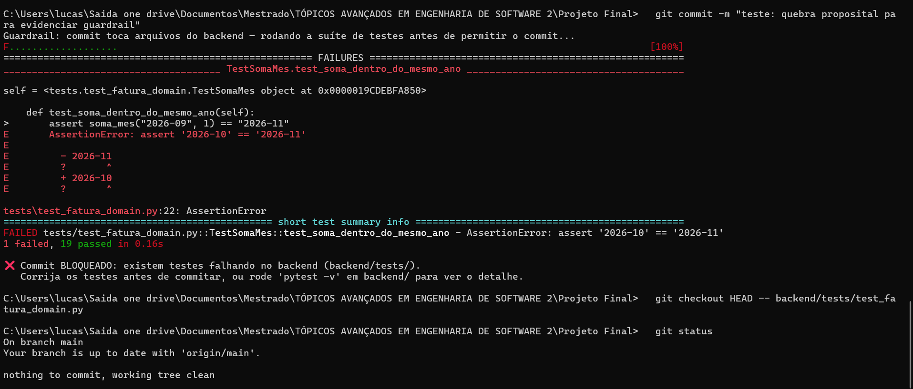

# ADR 0002 — Guardrail: hook de pre-commit bloqueando testes falhando no backend

## Status
Aceito

## Contexto
O edital exige "pelo menos um mecanismo de guardrail configurado de fato (hook, regra de permissão, ou ferramenta como TDD Guard/Superpowers) com evidência de que ele funcionou (bloqueio real, não apenas descrito)". Precisávamos de um mecanismo simples, sem dependências extras de instalação, que funcionasse igual nos dois computadores da dupla (Windows).

## Decisão
Usar um **git hook nativo de pre-commit**, versionado no próprio repositório em `githooks/pre-commit`, ativado por:

```bash
git config core.hooksPath githooks
```

O hook verifica se o commit contém arquivos dentro de `backend/`; se sim, roda `pytest -q` no backend **antes** de permitir o commit. Se algum teste falhar, o commit é **bloqueado** (o hook retorna código de saída 1) e o Git nunca cria o commit. Commits que mexem só no frontend não disparam a suíte (evita fricção desnecessária para quem está mexendo só na SPA).

## Alternativas consideradas
- **TDD Guard / Superpowers**: ferramentas mais completas, mas exigiriam configuração adicional fora do escopo de tempo do projeto.
- **Regra de permissão do Claude Code** (bloquear edição direta de código sem teste correspondente): mais difícil de demonstrar de forma objetiva na apresentação do que um bloqueio de commit, que é trivial de reproduzir ao vivo.

## Evidência de funcionamento

Procedimento seguido para gerar a evidência exigida pelo edital:
1. Quebrar propositalmente um teste em `backend/tests/test_fatura_domain.py` (alterado o `assert` de `test_soma_dentro_do_mesmo_ano` para um valor errado).
2. Tentar commitar essa mudança em `backend/`.
3. Capturar o print mostrando o Git recusando o commit com a mensagem "❌ Commit BLOQUEADO" — ver [`docs/evidencias/guardrail-bloqueio-commit.png`](../evidencias/guardrail-bloqueio-commit.png).
4. Desfazer a quebra proposital (`git checkout HEAD -- backend/tests/test_fatura_domain.py`) e confirmar que a árvore de trabalho voltou limpa (`git status`).



Esse print entra na apresentação (seção "Harness e controle de agentes") como evidência de bloqueio real.

## Consequências
- Positivo: sem dependência externa (usa só `git` e `pytest`, que já são exigidos pelo projeto); fácil de auditar (é um arquivo de texto no repositório); fácil de demonstrar ao vivo na apresentação.
- Negativo: só cobre o backend (lógica de domínio); não impede erros de lint/estilo — aceitável para o escopo do projeto.
