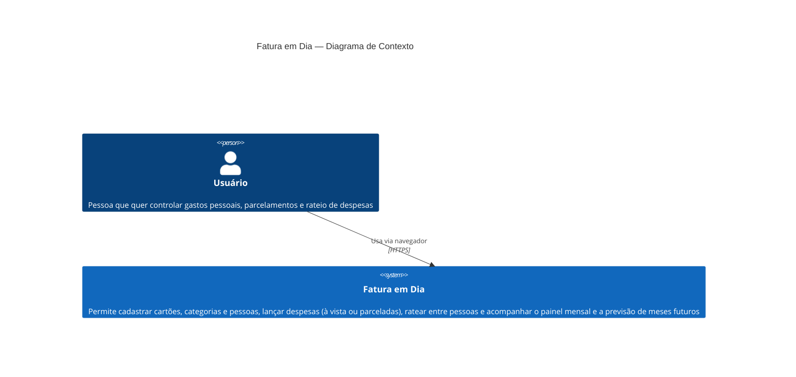
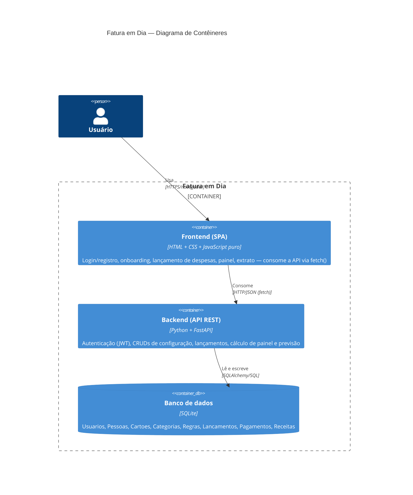
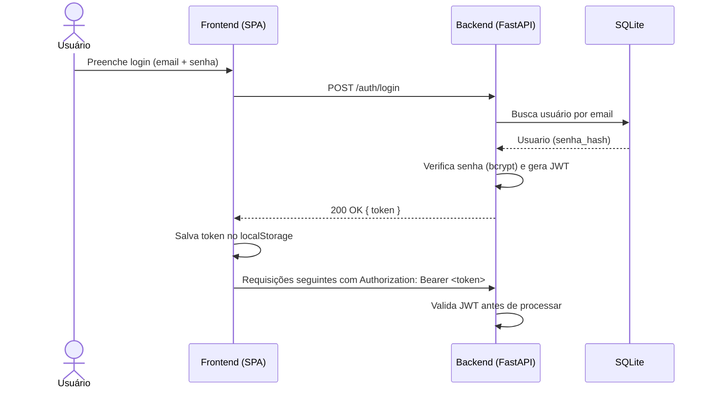

# Arquitetura — Fatura em Dia

Este documento complementa a [ADR 0001](adr/0001-arquitetura-rest-api.md) (decisão de dividir o sistema em backend REST + frontend SPA) e a [ADR 0002](adr/0002-guardrail-pre-commit.md) (guardrail) com uma visão visual da arquitetura, no estilo C4 (Contexto e Contêineres).

## Diagrama de contexto

Mostra o sistema como uma caixa única e quem interage com ele.



## Diagrama de contêineres

Detalha os blocos internos do sistema e como eles se comunicam.



## Componentes do backend

O backend é organizado em camadas para manter as regras de negócio isoladas de detalhes de framework/web (facilita testar `app/domain/fatura.py` sem subir servidor nenhum):

```mermaid
graph TD
    subgraph Backend [ "backend/app" ]
        main["main.py<br/>(entrypoint FastAPI, CORS, lifespan)"]

        subgraph routers [ "routers/ (camada HTTP)" ]
            r_auth["auth.py<br/>RF01 — cadastro/login"]
            r_config["config.py<br/>RF02–RF05, RF07 — onboarding, pessoas, cartões, categorias, regras"]
            r_lanc["lancamentos.py<br/>RF06, RF07 — lançar despesa"]
            r_painel["painel.py<br/>RF08–RF10 — painel, previsão, extrato, pagamentos"]
        end

        auth_py["auth.py<br/>(hash de senha + JWT)"]
        models["models.py<br/>(tabelas SQLAlchemy)"]
        schemas["schemas.py<br/>(contratos Pydantic)"]
        database["database.py<br/>(engine/sessão SQLite)"]

        subgraph domain [ "domain/ (regras de negócio puras)" ]
            fatura["fatura.py<br/>fatura_de, cada_um, gerar_parcelas, aplicar_regra"]
        end
    end

    main --> routers
    r_auth --> auth_py
    r_auth --> models
    r_config --> models
    r_lanc --> models
    r_lanc --> domain
    r_painel --> models
    r_painel --> domain
    routers --> schemas
    models --> database

    tests["tests/test_fatura_domain.py<br/>(20 testes unitários, TDD)"] -.->|testa isoladamente, sem subir API| fatura
```

## Fluxo de autenticação (JWT)


